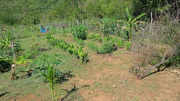
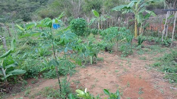
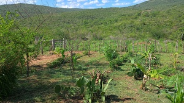
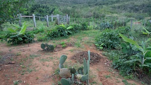
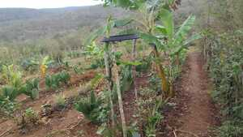

# SAF01 - Primeira Área Experimental

[← Voltar para Evolução](../evolucao.md) | [SAF02 →](saf02.md)

## 📋 Informações Gerais
- **Início**: Março 2023
- **Tamanho**: 6x10 metros (60m²)
- **Status**: Consolidado
- **Principais culturas**: Palma forrageira, Mandioca, Leucena

## 📸 Evolução Fotográfica

### Vista Superior - Antes e Depois
**Comparação: Outubro 2022 vs Março 2023**

     
     

### Lado Direito da Área
**Comparação: Janeiro 2024 vs Maio 2024**

 
     
     

  

### Lado Esquerdo da Área
**Comparação: Janeiro 2024 vs Maio 2024**

 
    
     

### Estado Atual - Setembro 2024
**Consolidação da Área**

 
    

---

## 📊 Principais Conquistas

### ✅ Culturas Estabelecidas
- **Palma Forrageira**: Adaptação excelente, fonte de água e alimento
- **Mandioca**: Produção suficiente para expansão do SAF02
- **Leucena**: Fixação de nitrogênio e forragem
- **Moringa**: Folhas nutritivas e crescimento rápido

### 🎯 Lições Aprendizadas
- **Timing de plantio**: Março não é ideal, preferir dezembro/janeiro
- **Preparação do solo**: Descompactação é fundamental
- **Manejo de água**: Cisterna foi crucial para o sucesso
- **Diversificação**: Múltiplas espécies aumentam resiliência

### 🔄 Melhorias Implementadas (Fim 2024)
- Cobertura de solo com Canjoão, Mamona e capim
- Adição de cinzas da olaria como fertilizante
- Plantio de 30 mudas adicionais (Leucena, Moringa, Casqueiro, Gliricídia)
- Estacas de cana de açúcar e sementes de Muvuca

---

## 🔗 Navegação

- [← Voltar para Evolução das Áreas](../evolucao.md)
- [SAF02 - Expansão Principal →](saf02.md)
- [Consórcios Planejados](../consorcios.md)
- [História do Projeto](../historia.md)
