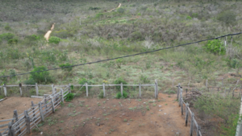
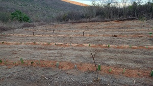
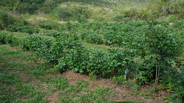
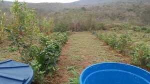
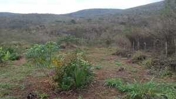

# SAF02 - Expansão Principal

[← SAF01](saf01.html) | [Voltar para Evolução](../evolucao.html)

## 📋 Informações Gerais
- **Início**: Dezembro 2023
- **Tamanho**: 20x30 metros (600m²)
- **Status**: Em desenvolvimento
- **Principais culturas**: Expansão das culturas do SAF01

## Fotos

- Antes de limpar, outubro 2022

		

- Após implantação, 15.12.2023

		

- Após roçar pela primeira vez, janeiro 2024

		

- 31 de maio de 2024

    

- 08 de setembro de 2024

    
    

